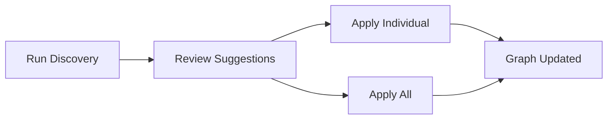
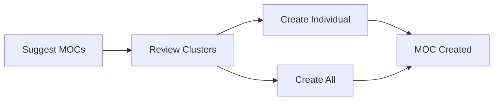

# Knowledge Graph Auto-Mapper v3.0 - Quick Start Guide

## 🚀 Getting Started in 5 Minutes

The Knowledge Graph Auto-Mapper helps you discover hidden connections, organize your notes, and track your knowledge graph growth—all powered by AI.

---

## Installation & Setup

### 1. Prerequisites

- MarkItUp installed and running
- AI provider configured (OpenAI, Anthropic, Gemini, or Ollama)
- At least 5-10 notes in your workspace

### 2. Enable the Plugin

1. Open Settings → Plugins
2. Find "Knowledge Graph Auto-Mapper"
3. Click "Enable"
4. Configure AI settings if needed

### 3. First Run

```
Command Palette (Cmd/Ctrl+Shift+P)
→ "Discover Hidden Connections"
```

Wait 10-30 seconds while AI analyzes your notes.

---

## Core Workflows

### Workflow 1: Discover & Apply Connections

**Goal:** Find and add semantic connections between notes



**Steps:**

1. **Discover Connections**
   - Command: `Discover Hidden Connections`
   - Shortcut: `Cmd+Shift+D`
   - Wait for AI analysis

2. **Review Suggestions**
   - Modern UI dialog appears
   - Shows connection suggestions with confidence scores
   - Adjust threshold slider if needed

3. **Apply Connections**
   - Click "Apply" on individual suggestions
   - Or click "Apply All" for batch operation
   - Suggestions turn green when applied

4. **Undo if Needed**
   - Command: `Undo Last Graph Action`
   - Shortcut: `Cmd+Shift+Z`
   - Reverses last applied connection

---

### Workflow 2: Create Maps of Content (MOCs)

**Goal:** Create hub notes to organize related topics



**Steps:**

1. **Get MOC Suggestions**
   - Command: `Suggest Maps of Content`
   - AI analyzes note clusters

2. **Review Suggestions**
   - See suggested MOC titles
   - Check priority levels (High/Medium/Low)
   - Review which notes would be connected

3. **Create MOCs**
   - Click "Create" on individual MOCs
   - Or click "Create All MOCs" for batch
   - New MOC notes appear in your workspace

4. **Customize MOCs**
   - Edit MOC content as needed
   - Add sections and context
   - Reorganize links

---

### Workflow 3: Track Your Growth

**Goal:** Monitor knowledge graph health and growth

**Steps:**

1. **Open Analytics**
   - Command: `Show Analytics Dashboard`
   - View comprehensive metrics

2. **Review Metrics**
   - Health Score (0-100%)
   - Total connections made
   - Growth rate (7-day trend)
   - Most connected notes

3. **Take Action**
   - Click "Connect Orphan Notes" if score is low
   - Click "Suggest MOCs" for better organization
   - Export reports for review

---

### Workflow 4: Export & Share

**Goal:** Save or share your suggestions

**Steps:**

1. **Export Suggestions**
   - Command: `Export Suggestions`
   - Choose format (JSON/CSV/Markdown)
   - File downloads automatically

2. **Share or Backup**
   - Send to team members
   - Import into other tools
   - Archive for future reference

3. **Import Later**
   - Command: `Import Suggestions`
   - Select JSON file
   - Suggestions loaded and ready to apply

---

## Essential Commands

| Command | Shortcut | Description |
|---------|----------|-------------|
| Discover Hidden Connections | `Cmd+Shift+D` | Find semantic connections |
| Analyze & Name Clusters | - | Detect and name note groups |
| Suggest Maps of Content | - | Recommend hub notes |
| Find Bridge Note Opportunities | - | Connect isolated clusters |
| Connect Orphan Notes | - | Link isolated notes |
| Knowledge Graph Health Check | - | Comprehensive analysis |
| Apply All Suggested Connections | - | Batch apply connections |
| Create All Suggested MOCs | - | Batch create MOCs |
| **Undo Last Graph Action** | `Cmd+Shift+Z` | Reverse last action |
| **Show Analytics Dashboard** | - | View growth metrics |
| **Export Suggestions** | - | Download suggestions |
| **Import Suggestions** | - | Load saved suggestions |

---

## Key Settings

Access: Settings → Plugins → Knowledge Graph Auto-Mapper

### Must-Know Settings

| Setting | Default | Purpose |
|---------|---------|---------|
| Minimum Similarity Score | 0.7 | Threshold for suggestions (0-1) |
| Use Modern UI | true | Enable beautiful React dialogs |
| Enable Notifications | true | Show success/error messages |
| Auto-Save Analysis Reports | true | Save reports as notes |
| Maximum History Items | 50 | Undo history size |
| Export Format | json | Default export format |

### Recommended Tweaks

**For Conservative Users:**
- Set Minimum Similarity to 0.8+
- Enable "Confirm Before Applying Changes"
- Lower Batch Minimum Confidence to 0.9

**For Power Users:**
- Set Minimum Similarity to 0.6
- Disable confirmations
- Increase Maximum History to 100

**For Teams:**
- Export Format: CSV (easier to share)
- Track Effectiveness: Enabled
- Save Reports: Enabled

---

## Tips & Tricks

### 🎯 Pro Tips

1. **Run Discovery Weekly**
   - Best practice: Every Monday morning
   - Catches new connections from week's work
   - Keeps graph fresh and organized

2. **Use Filters Wisely**
   - Adjust confidence slider before applying
   - Start high (85%+) then lower if needed
   - Review low-confidence suggestions manually

3. **Track Your Progress**
   - Check analytics dashboard monthly
   - Celebrate growth milestones
   - Identify under-connected topics

4. **Export Before Batch Operations**
   - Backup suggestions before "Apply All"
   - Gives you a safety net
   - Can re-import if needed

5. **Leverage Undo Fearlessly**
   - Experiment with suggestions
   - Undo mistakes instantly
   - Learn what works for your graph

### ⚡ Keyboard Shortcuts

```
Cmd+Shift+D     → Discover Connections
Cmd+Shift+Z     → Undo Last Action
Cmd+Shift+P     → Command Palette (access all commands)
```

### 🎨 Visual Cues

**In Graph View:**
- 🟢 **Green dashed line** = High confidence (80%+)
- 🟡 **Yellow dashed line** = Medium confidence (70-79%)
- 🟠 **Orange dashed line** = Lower confidence (<70%)
- 🔵 **Solid blue line** = Applied connection

---

## Common Scenarios

### Scenario 1: Starting a New Project

**Situation:** Just created 20 new notes about machine learning

**Best Approach:**

1. Run `Discover Hidden Connections`
2. Apply high-confidence suggestions (85%+)
3. Run `Suggest Maps of Content`
4. Create a "Machine Learning MOC"
5. Check analytics to see initial structure

### Scenario 2: Cleaning Up Old Notes

**Situation:** 100+ old notes, many unconnected

**Best Approach:**

1. Run `Knowledge Graph Health Check`
2. Note orphan count
3. Run `Connect Orphan Notes`
4. Review and apply suggestions
5. Run health check again to measure improvement

### Scenario 3: Weekly Maintenance

**Situation:** Regular note-taking, weekly review

**Best Approach:**

1. Monday: Run `Discover Hidden Connections`
2. Review suggestions during coffee
3. Apply obvious connections
4. Export remaining for deeper review
5. Check analytics dashboard for trends

### Scenario 4: Team Collaboration

**Situation:** Multiple people contributing notes

**Best Approach:**

1. Each person runs discovery on their notes
2. Export suggestions to shared folder
3. Team lead imports and reviews all
4. Apply consensus connections
5. Share analytics report with team

---

## Troubleshooting

### "No suggestions found"

**Causes:**
- Notes too short (need 50+ words)
- Topics too different
- Minimum similarity too high

**Solutions:**
- Lower similarity threshold to 0.6
- Add more content to notes
- Check if AI service is working

### "Analytics dashboard empty"

**Cause:** No actions taken yet

**Solution:** 
- Apply some connections first
- Wait 24 hours for data to accumulate
- Check "Track Effectiveness" is enabled

### "Undo not working"

**Causes:**
- History limit exceeded
- Note was deleted
- Manual edit after action

**Solutions:**
- Increase max history in settings
- Use immediately after action
- Avoid manual edits between undo

---

## What's Next?

### Explore Advanced Features

1. **Bridge Notes** - Connect isolated clusters
2. **Relationship Categorization** - AI tags link types
3. **Cluster Analysis** - Understand your topic groups
4. **Export Workflows** - Integrate with other tools

### Stay Updated

- Check for plugin updates monthly
- Review changelog for new features
- Join community discussions

### Provide Feedback

- Report issues on GitHub
- Suggest features in discussions
- Share your workflows with community

---

## Quick Reference Card

```
┌────────────────────────────────────────────────┐
│  KNOWLEDGE GRAPH AUTO-MAPPER v3.0             │
│  Quick Reference                               │
├────────────────────────────────────────────────┤
│  DISCOVER      Cmd+Shift+D                     │
│  UNDO          Cmd+Shift+Z                     │
│  ANALYTICS     Command Palette → Show Analytics│
│  EXPORT        Command Palette → Export        │
├────────────────────────────────────────────────┤
│  WORKFLOW:                                     │
│  1. Discover → 2. Review → 3. Apply → 4. Undo │
├────────────────────────────────────────────────┤
│  CONFIDENCE LEVELS:                            │
│  🟢 80%+ = High    🟡 70-79% = Medium          │
│  🟠 <70% = Low                                 │
└────────────────────────────────────────────────┘
```

---

**Version 3.0.0**  
*Last Updated: October 16, 2025*  
*Status: Production Ready*

For detailed documentation, see `KNOWLEDGE_GRAPH_AUTO_MAPPER_V3_COMPLETE.md`  
For changelog, see `KNOWLEDGE_GRAPH_AUTO_MAPPER_V3_CHANGELOG.md`
