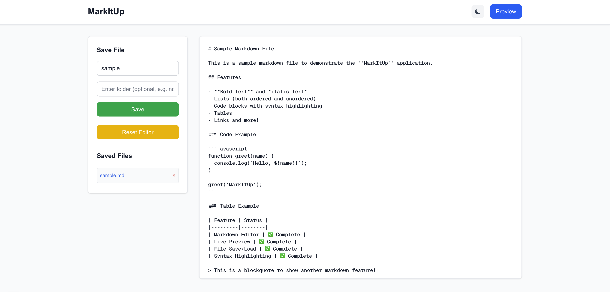

# MarkItUp PKM – Personal Knowledge Management System

*A powerful, self-hosted Personal Knowledge Management system that rivals Obsidian. Built with Next.js and TypeScript, MarkItUp transforms markdown editing into a comprehensive second brain for organizing, linking, and discovering your thoughts.*



## 🆕 What's New

### v4.0.0 - November 2025 🚀

- 🔐 **User Authentication & Authorization** - Secure multi-user support with JWT sessions
- 🧭 **Unified AI Settings** - Centralized configuration across all AI features
- 🛡️ **Enhanced Security** - Improved CSP headers and Docker/Ollama compatibility
- 🤖 **AI Robustness** - Better JSON parsing and proxy diagnostics
- � **Optional Volume Mounts** - Simplified deployment for managed hosting scenarios

> **Breaking Change:** Authentication now required by default. See [docs/MIGRATION_4_0.md](docs/MIGRATION_4_0.md) for migration guide or set `DISABLE_AUTH=true` for single-user mode.

### Recent Highlights

- ✨ **WYSIWYG Editor** - Rich text editing with TipTap
- � **Intelligent Link Suggester** - AI-powered wikilink suggestions with real-time analysis
- 📚 **Spaced Repetition** - Scientific flashcard system with FSRS algorithm
- 🤖 **Universal AI Support** - OpenAI, Anthropic, Gemini, or Ollama (100% local/private)
- � **Semantic Search** - Browser-based ML for meaning-based discovery
- 🤝 **Real-time Collaboration** - Multi-user editing with WebSocket sync

See [CHANGELOG.md](CHANGELOG.md) for complete version history.

## 🚀 Quick Start

```bash
git clone https://github.com/xclusive36/MarkItUp.git
cd MarkItUp
npm install
npm run dev
```

Visit [http://localhost:3000](http://localhost:3000) and start building your knowledge base!

## ✨ Key Features

### 📚 Core Knowledge Management

- **Bidirectional Linking** - Connect notes with `[[wikilinks]]` and automatic backlinks
- **Knowledge Graph** - Visual exploration with 3D force-directed layouts
- **Advanced Search** - Full-text search with operators (`tag:`, `folder:`, exact phrases)
- **Semantic Search** - AI-powered vector search finds related content by meaning, not just keywords:
  - 🧠 **Browser-Based ML** - Client-side embeddings using Transformers.js (no server required!)
  - 🔍 **Similarity Discovery** - Find related notes based on semantic similarity
  - 📊 **Progress Tracking** - Real-time indexing with visual progress indicators
  - 💾 **IndexedDB Storage** - Efficient persistent storage for embeddings
  - ⚡ **Fast Search** - Sub-100ms queries for typical collections
  - 🎯 **Mode Toggle** - Switch between keyword and semantic search instantly
  - 🔒 **100% Private** - All processing happens locally in your browser
  - ⚙️ **Configurable** - Batch size, auto-indexing, and more in settings
- **Smart Tagging** - Organize with `#tags` and automatic indexing
- **Real-time Analytics** - Track your knowledge growth

### 🤖 AI-Powered Intelligence

**All AI features work with your choice of provider (OpenAI, Anthropic, Gemini, or Ollama):**

- **Intelligent Link Suggester** - AI finds connection opportunities in your knowledge base:
  - 🔍 Context-aware wikilink suggestions with confidence scoring
  - 🚀 Batch orphan analysis for vault-wide optimization
  - 💡 Visual context preview shows where links will be inserted
  - ⚡ Real-time suggestions while typing (optional)
  - 🧠 Pattern learning adapts to your preferences
  - 🌉 Bridge note suggestions to connect isolated clusters
  - 📊 Knowledge base health visualization
- **Context-Aware AI Chat** - AI assistant that understands your knowledge graph
- **Writing Assistant** - Advanced content analysis and improvement suggestions
- **Knowledge Discovery** - AI-powered gap analysis and content recommendations
- **Research Assistant** - Semantic search with intelligent note creation
- **Multi-Provider Support** - Choose once, use everywhere: OpenAI (GPT-4, GPT-3.5), Anthropic (Claude 3.5), Google Gemini (1.5 Pro/Flash), or Ollama (local AI)

#### 🏠 Ollama Local AI (Privacy-First)

MarkItUp features the most comprehensive Ollama integration in any PKM system:

- **🌊 Real-Time Streaming** - Progressive response display with Server-Sent Events
- **📊 Model Management** - Download, delete, and refresh models directly from the UI
- **🔌 Connection Testing** - One-click server verification with detailed status (no CORS errors!)
- **⚙️ Advanced Parameters** - Fine-tune context window, GPU layers, repeat penalty, and more
- **📦 Enhanced Model Details** - View size, parameter count (7B/13B/70B), and quantization levels
- **💾 Zero Cost** - No API keys, no usage limits, completely free local AI
- **🔒 Complete Privacy** - All data stays on your machine, no external API calls
- **🚀 Model Library** - Browse and install popular models (Llama 3.2, Mistral, CodeLlama, etc.)
- **🎯 Custom Servers** - Connect to remote Ollama instances with saved presets
- **📈 Performance Metrics** - Track tokens/second, response times, and model efficiency
- **🛡️ Seamless Integration** - Built-in CORS proxy for error-free connections (no Ollama config needed!)

**Getting Started with Ollama:**

1. Install Ollama: `brew install ollama` (macOS) or visit [ollama.ai](https://ollama.ai)
2. Start server: `ollama serve`
3. Pull a model: `ollama pull llama3.2` or use MarkItUp's UI
4. Select "Ollama (Local)" in AI Settings - no API key needed!

**Why Choose Ollama?**

- 100% private - ideal for sensitive knowledge bases
- Offline capable after model download
- No monthly costs or token limits
- Full control over AI infrastructure
- Supports 50+ open-source models

### 🤝 Real-time Collaboration

- **Multi-user Editing** - Real-time collaborative editing with conflict resolution
- **Live Presence** - See other users' cursors and selections
- **WebSocket Sync** - Low-latency synchronization via Socket.IO
- **Session Sharing** - Easy document sharing with secure links

### 🔌 Extensible Plugin System

- **Rich Plugin API** - Custom functionality, commands, and processors
- **Settings Management** - Configurable plugin settings with persistence
- **Content Processors** - Transform content during import/export
- **Event System** - Plugin communication through events

### 📝 Advanced Markdown Features

- **WYSIWYG Editor** - Rich text editing with TipTap, seamless markdown conversion
- **Multi-mode Editor** - Edit, preview, split-view, or WYSIWYG modes
- **LaTeX Math** - Inline `$math$` and block `$$math$$` equations
- **TikZ Diagrams** - Create vector graphics directly in markdown
- **GitHub Flavored Markdown** - Tables, task lists, and more

## 📚 Documentation

| Topic | Description |
|-------|-------------|
| [🎯 Features](docs/FEATURES.md) | Complete feature overview and capabilities |
| [⚙️ Installation](docs/INSTALLATION.md) | Detailed setup and configuration guide |
| [📖 User Guide](docs/USER_GUIDE.md) | How to use PKM features effectively |
| [🤖 AI Features](docs/AI_FEATURES.md) | AI setup and advanced capabilities |
| [🤝 Collaboration](docs/COLLABORATION.md) | Real-time editing and sharing |
| [🔌 Plugin System](docs/PLUGIN_SYSTEM.md) | Using and developing plugins |
| [🐳 Deployment](docs/DEPLOYMENT.md) | Docker and production hosting |
| [🔧 API Reference](docs/API_REFERENCE.md) | Technical documentation |
| [⚖️ Comparison](docs/COMPARISON.md) | MarkItUp vs Obsidian and others |

## 🏆 Why MarkItUp PKM?

**🌐 Web-Native:** Access from any device with a browser - no app installation required

**🏠 Complete Privacy:** Self-hosted solution means your data never leaves your control

**🔗 Built for Connection:** Native wikilinks, backlinks, and graph visualization

**⚡ Modern Stack:** Built with Next.js 16 and TypeScript for speed and reliability

**🆓 Truly Free:** Open-source with no licensing fees or feature restrictions

**🚀 Extensible:** Modern plugin architecture for unlimited customization

### 🤖 AI Provider Comparison

MarkItUp offers the most flexible AI integration in any PKM system:

| Feature | OpenAI | Anthropic | Gemini | **Ollama** |
|---------|--------|-----------|--------|------------|
| **Streaming** | ✅ | ✅ | ✅ | ✅ |
| **API Key Required** | ✅ Yes | ✅ Yes | ✅ Yes | ❌ **None** |
| **Cost** | $0.002-0.03/1K tokens | $0.003-0.015/1K tokens | $0.000075-0.00125/1K tokens | 🆓 **Free** |
| **Context Window** | 128K tokens | 200K tokens | 🚀 **1M tokens** | Varies by model |
| **Model Management** | ❌ | ❌ | ❌ | ✅ **Yes** |
| **Advanced Options** | ✅ | ✅ | ✅ | ✅ **8+ params** |
| **Privacy (Local)** | ❌ Cloud | ❌ Cloud | ❌ Cloud | ✅ **100% Local** |
| **Connection Health** | ✅ | ❌ | ✅ | ✅ **Yes** |
| **Offline Mode** | ❌ | ❌ | ❌ | ✅ **Yes** |
| **Performance Tracking** | ✅ | ✅ | ✅ | ✅ **Yes** |
| **Usage Limits** | Pay per use | Pay per use | Pay per use | ✅ **Unlimited** |

**Choose the right provider for your needs:**

- **OpenAI** - Most capable general-purpose AI (GPT-4)
- **Anthropic** - Long context windows, ethical AI (Claude 3.5)
- **Gemini** - Most cost-effective with massive 1M token context (Gemini 1.5 Pro/Flash)
- **Ollama** - Complete privacy, zero cost, offline capable (50+ models)

## 🐳 Quick Deploy

### Docker Compose (Recommended)

**⚠️ REQUIRED: Generate secure secrets before deploying:**

```bash
# Generate JWT_SECRET
openssl rand -base64 32

# Generate ENCRYPTION_KEY
openssl rand -hex 16
```

**Create `docker-compose.yml`:**

```yaml
version: "3.8"

services:
  markitup:
    container_name: markitup
    ports:
      - 3000:3000
    # volumes:
      # Optional: Uncomment to persist markdown files on host filesystem
      # Note: Requires chmod 777 ./markdown for write permissions
      # For managed hosting or ephemeral deployments, leave commented
      # - ./markdown:/app/markdown
    environment:
      - PORT=3000
      - HOSTNAME=0.0.0.0
      - NODE_ENV=production
      # REQUIRED: Replace with your generated secrets
      - JWT_SECRET=your-generated-jwt-secret-here
      - ENCRYPTION_KEY=your-generated-encryption-key-here
      # Optional: Disable auth for testing (NOT FOR PRODUCTION)
      # - DISABLE_AUTH=false
    restart: unless-stopped
    image: ghcr.io/xclusive36/markitup:latest
```

```bash
docker compose up -d
```

### Docker CLI

```bash
# Generate secrets
JWT_SECRET=$(openssl rand -base64 32)
ENCRYPTION_KEY=$(openssl rand -hex 16)

# Run without persistent storage (default)
docker run --name markitup -p 3000:3000 \
  -e JWT_SECRET="$JWT_SECRET" \
  -e ENCRYPTION_KEY="$ENCRYPTION_KEY" \
  --restart unless-stopped \
  ghcr.io/xclusive36/markitup:latest

# OR with persistent storage
docker run --name markitup -p 3000:3000 \
  -v ./markdown:/app/markdown \
  -e JWT_SECRET="$JWT_SECRET" \
  -e ENCRYPTION_KEY="$ENCRYPTION_KEY" \
  --restart unless-stopped \
  ghcr.io/xclusive36/markitup:latest
```

### 📦 Data Persistence (Optional)

By default, data lives in the container. To persist data on your host:

1. **Uncomment the volume mount** in docker-compose.yml or add `-v ./markdown:/app/markdown` to docker run
2. **Set permissions:**

```bash
# Easy method (all users can write)
chmod -R 777 ./markdown

# Secure method (container user only)
sudo chown -R 1001:1001 ./markdown
```

> For managed hosting, skip volume mounts and implement alternative storage (S3, database, etc.)

## 🤝 Contributing

We welcome contributions! Please see our [contribution guidelines](CONTRIBUTING.md) for details.

- 🐛 **Bug Reports:** [Open an issue](https://github.com/xclusive36/MarkItUp/issues)
- 💡 **Feature Requests:** [Start a discussion](https://github.com/xclusive36/MarkItUp/discussions)
- 🔧 **Pull Requests:** Fork, develop, and submit PRs

## 📄 License

MIT License - see [LICENSE](LICENSE) file for details.

---

**⭐ Star this repo if you find MarkItUp useful!**

Built with ❤️ by the MarkItUp community
